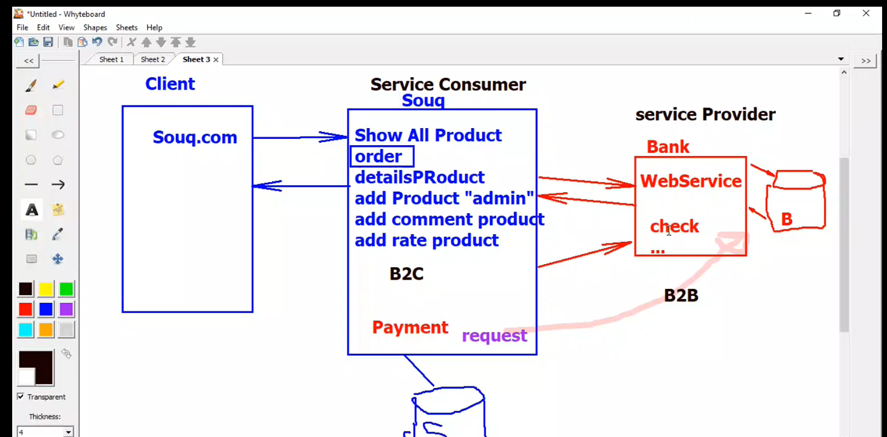
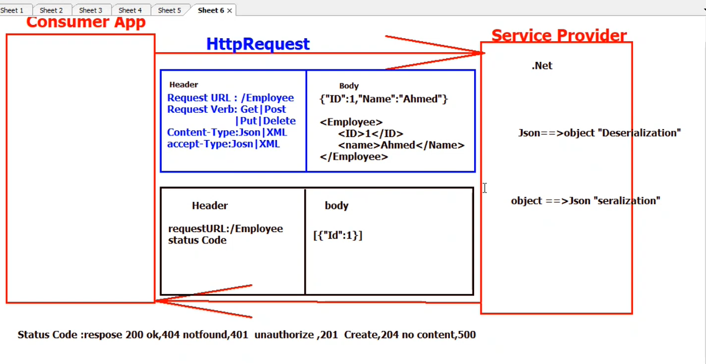

## History of Web API  idea : 
Web API is host dll that has methods on server 
and every one want to use this method should send 
request to server which is called web serivce  , here  are the techologies that microsoft did to simulate WebAPI  :

 * web servies "http"
* WCF "http/TCP"
* Restful WCF "HTTP"
 * web API  "HTTP"  .NET Framework 
* web API core  .NET Core 

## Restful Web API Core  version 5
* Backed --> .net 
* frontend -> anguler - react - wpf - mvc - html - mobile App
*  open servce to another application  (server )

## What's Restful ??
 * architecture style  provide standard between system communications
 * server / client  --> provider / constumer 
 * stateless  --> http
 *  able to cache 
 * uniform name  : 
   *  models called resources 
   *  each resource has URL 
    *  URL  :
        * controllename  + request verb  
        * reques verb  --> get - post -put - delete 
 * Message Standard format like json / XML 

## HTTP request in details  : 

##  Notes  :
 *  Swager cannot understand  convision names  GetEmployess - PostEmployees , but postman can 
*  you should use flages with swager to declare request verb 
   like [HttpGet] -[HttpPost]
* in API we return status code function that inhert from IAction Result  like  200 -> ok(model)
* to make two action with same request verb  you should use this flage  [Route("{id}"})]
* to put integer constrain on id [Route("{id:int}")]
* to make id optional  [Route("{id?:int}")]
* to put string constrain on name [Route("{name:alpha}")]
* to test your code use applications that  build request :
  * post man 
  * filldler 
  * third part packages  swagger 
* created --> status code 201 means create or add 
* created -->  function always send location of the object that you created 
*  to get current domain Url.Link ("GetOneDeptRoute" , new {id = dept.id  })
* you can assign name to  action route  [HttpGet ( "{} " ),Name ="GetoneDeptRoute" ]
* BadRequest --> 400  code status 
* StatusCode --> 204  code status means delete 
* using remove statment with context could throw expection so you 
  should use try and catch.
