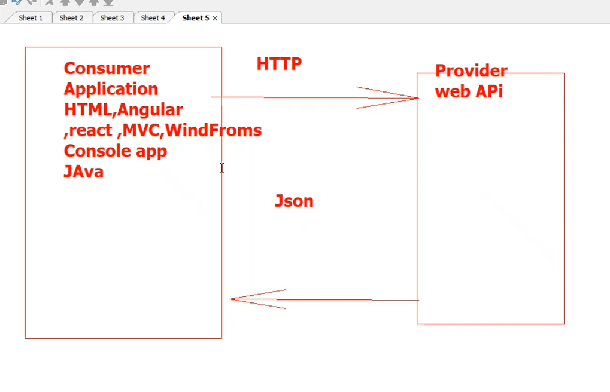
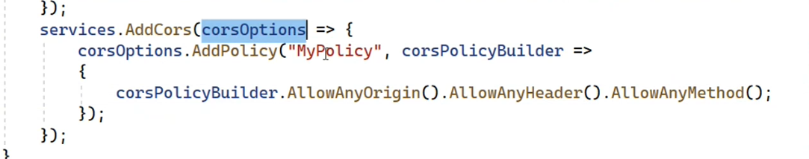

## Binding in API 
 * Bind Primitive Type  :
   * route segment /id/   --> first 
   * Query string ?id=1&name =dddd&.. --> second 
* Bind complex type : 
   * request body 
* you can use [FromBody] [FromRoute] [FromQuery] flages 
  to force binding place on your paramter .
* body request hold only one object
* query string can hold any number of objects 
* segement route can hold any number of objects , but you should write all objects in [Http("{id}"/"{name}")].
* note : if you want binding complex type from route , write 
variables in route ?name=&manager=  .. /id/manager 
* you should use only one flag body in action , more than one will throw expection
## Json Ignore and DIO (Data transfer object )
* when you use more than class and there are relations between them , then request faild and cycle  happens
*  cause of serization of navigation property 
* to solve this problem there are two solutions :
   * use [JsonIgnore] flag 
   * use DIO to hide model structure and solve serializtion problem  cycle .
* DIO solution is bettern than JsonIgnore solution .

## Cros policy 
 * Origin (Provider) use this policy to allow specific servers or apps  (consumer) 
   to use it's web servies - B2B .

