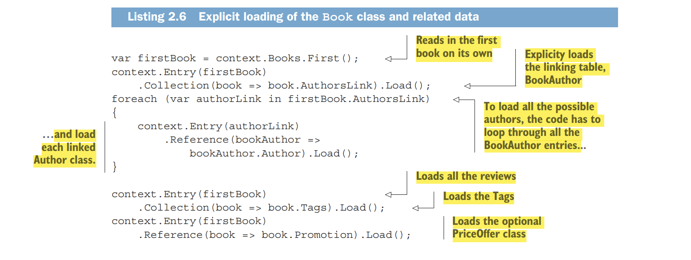
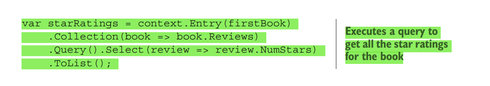
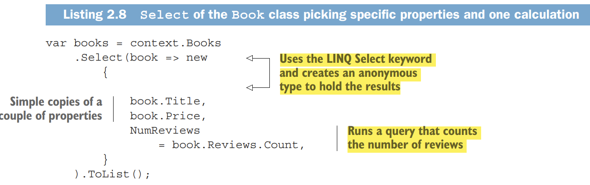

# Chapter 2  -  Querying  the database 

### Database Schema

* MANY-TO-MANY RELATIONSHIP: MANUALLY CONFIGURED
Books can be written by one or more authors, and an author may write one or more
books. Therefore, you need a table called Books to hold the books data and another
table called Authors to hold the authors. The link between the Books and Authors
tables is called a many-to-many relationship, which in this case needs a linking table to
achieve this relationship.
 In this case, you create your own linking table with an Order value in it because the
names of the authors in a book must be displayed in a specific order (figure 2.3).

* 

* classes in entity framework 

    
    

* For one-to-one relationships, you can make the foreign key be the primary key too. In the PriceOffer
table shown in figure 2.1, you would have a primary key, called BookId, which
would also be the foreign key. As a result, you lose the PriceOfferId column.

*  The BookTags table is automatically created by EF Core
when you set up a many-to-many relationship that
doesn’t need any extra columns in the linking table.

* But accessing an existing database is much easier, because EF Core
can build your application’s DbContext class and all your entity classes for you, using
a feature called reverse engineering, which is covered in section 9.7.

* Run the command Update-Database to apply the commands created by the AddMigration command to your database. If no database exists, Update-Database
will create one. If a database exists, the command checks whether that database
has this database migration applied to it, and if any database migrations are
missing, this command applies them to the database. (See chapter 9 for more
on migration commands.)

* NOTE You can also use EF Core’s .NET Core command-line interface (CLI)
to run these commands (see http://mng.bz/454w). Chapter 9 lists both the
Visual Studio and CLI versions of the migration commands

* An alternative to using the Update-Database command is to call the context.Database.Migrate method in the startup code of your application. This approach is especially useful for an ASP.NET Core web application that’s hosted; chapter 5 covers this
option, including some of its limitations.

* Now you can start looking at how to query a database by using EF Core. Figure 2.8
shows an example EF Core database query, with the three main parts of the query highlighted

  

* the LINQ is held
as a series of commands in what is called an expression tree (see section A.2.2), which
means that it hasn’t been executed on the data yet. EF Core can translate an expression tree into the correct commands for the database you’re using. In EF Core, a
query is executed against the database when
  *  It’s enumerated by a foreach statement.
  * It’s enumerated by a collection operation such as ToArray, ToDictionary,
ToList, ToListAsync, and so forth.

* The two types of database queries
  * The database query in figure 2.8 is what I call a normal query, also known as a read-write
query. This query reads in data from the database in such a way that you can update
that data (see chapter 3) or use it as an existing relationship for a new entry, such as
creating a new book with an existing Author (see section 6.2.2). 

  * The other type of query is an AsNoTracking query, also known as a read-only
query. This query has the EF Core’s AsNoTracking method added to the LINQ query
(see the following code snippet). As well as making the query read-only, the AsNoTracking method improves the performance of the query by turning off certain EF
Core features; see section 6.12 for more information:
context.Books.AsNoTracking()
 .Where(p => p.Title.StartsWith("Quantum")).ToList();
NOTE Section 6.1.2 provides a detailed list of the differences between the
normal, read-write query and the AsNoTracking, read-only query.

* Now I want to explain how you, as a developer,
can access the data behind these relationships. You can load data in four ways: 
    * eager loading 
    * explicit loading 
    * select loading
    *  lazy loading

### Eager Loading 
* However, you need to be aware that EF Core won’t load any relationships
in an entity class unless you ask it to. If you load a Book class, each of the relationship
properties in the Book entity class (Promotion, Reviews, and AuthorsLink) will be
null by default.

*  This default behavior of not loading relationships is correct, because it means that
EF Core minimizes the database accesses. If you want to load a relationship, you need
to add code to tell EF Core to do that.

* Eager loading example  using include statment 

  

* If you look at the SQL command that this EF Core query creates, shown in the following snippet, you’ll see two SQL commands. The first command loads the first row in
the Books table. The second loads the reviews, where the foreign key, BookId, has the
same value as the first Books row primary key.

* Example about complex query using eager loading :

  
  

 * If the relationship doesn’t exist (such as the optional PriceOffer class pointed to by
the Promotion property in the Book class), Include doesn’t fail; it simply doesn’t load
anything, or in the case of collections, it returns an empty collection (a valid collection with zero entries). The same rule applies to ThenInclude: if the previous Include
or ThenInclude was empty, subsequent ThenIncludes are ignored. If you don’t
Include a collection, it is null by default.

* The advantage of eager loading is that EF Core will load all the data referred to by
the Include and ThenInclude in an efficient manner, using a minimum of database
accesses, or database round-trips. 

* I find this type of loading to be useful in relational
updates in which I need to update an existing relationship; chapter 3 covers this topic.
I also find eager loading to be useful in business logic; chapter 4 covers this topic in
much more detail.

*  The downside is that eager loading loads all the data, even when you don’t need
part of it. The book list display, for example, doesn’t need the book description, which
could be quite large.

* The only LINQ commands you can use in the Include or ThenInclude methods
are Where, OrderBy, OrderByDescending, ThenBy, ThenByDescending, Skip, and Take,
but those commands are all you need for sorting and filtering.

  
 

### Explicit loading: Loading relationships after the primary entity class

* The second approach to loading data is explicit loading. After you’ve loaded the primary entity class, you can explicitly load any other relationships you want. Listing 2.6
does the same job as listing 2.4 with explicit loading. First, it loads the Book; then it
uses explicit-loading commands to read all the relationships.

    

    

    

* The advantage of explicit loading is that you can load a relationship of an entity class
later.

* The downside of explicit loading is more database round trips, which can be inefficient. If you know up front the data you need, eager loading the data is usually more
efficient because it takes fewer database round trips to load the relationships.

### Select loading: Loading specific parts of primary entity class and any relationships

* The third approach to loading data is using the LINQ Select method to pick out the
data you want, which I call select loading.
  

* The advantage of this approach is that only the data you need is loaded, which can be
more efficient if you don’t need all the data.

* Which is also efficient in terms of database
round trips.

* The downside to the select-loading approach is that you need to write code for each
property/calculation you want. In section 7.15.4, I show a way to automate this process.

### Lazy loading: Loading relationships as required

* Lazy loading makes writing queries easy, but it has a bad effect on database performance. Lazy loading does require some changes to your DbContext or your entity
classes, but after you make those changes, reading is easy; if you access a navigational
property that isn’t loaded, EF Core will execute a database query to load that navigational property.
You can set up lazy loading in either of two ways:
   * Adding the Microsoft.EntityFrameworkCore.Proxies library when configuring
your DbContext
   * Injecting a lazy loading method into the entity class via its constructor

* To configure the simple lazy loading approach, you must do two things:
  * Add the keyword virtual before every property that is a relationship.
  * Add the method UseLazyLoadingProxies when setting up your DbContext.

* Using the EF Core’s Proxy library has a limitation: you must make every relational property virtual; otherwise, EF Core will throw an exception when you use the DbContext

* The second part is adding the EF Core’s Proxy library to the application that sets
up the DbContext and then adding the UseLazyLoadingProxies to the configuring of
the DbContext. The following code snippet shows the added method to the DbContext shown in listing 2.2 

    (UseLazyLoadingProxies):
    var optionsBuilder =
    new DbContextOptionsBuilder<EfCoreContext>();
    optionsBuilder
    .UseLazyLoadingProxies()
    .UseSqlServer(connection);
    var options = optionsBuilder.Options;
    using (var context = new EfCoreContext(options)) .

*  When you have configured lazy loading in your entity      classes and in the way you create
    the DbContext, reading relationships is simple; you don’t need extra Include methods in your query because the data is loaded from the database when your code
    accesses that relationship property.

* Many developers find lazy loading to be useful, but I avoid it because of its performance issues. There is time overhead for every access to the database server, so the
best approach is to minimize the number of calls to the database server

*  But lazy loading (and explicit loading) can create lots of database accesses, making the query slow
and causing the database server to work harder.

* Tip :  Even  you have set up a relational property for lazy loading, you can get
better performance by adding an Include on a virtual relational property.
The lazy loading will see that the property has been loaded and not load it
again. Changing the first line of listing 2.9 to context.BookLazy.Include
(book => book.Reviews).Single(), for example, would reduce the two database accesses to one access.

